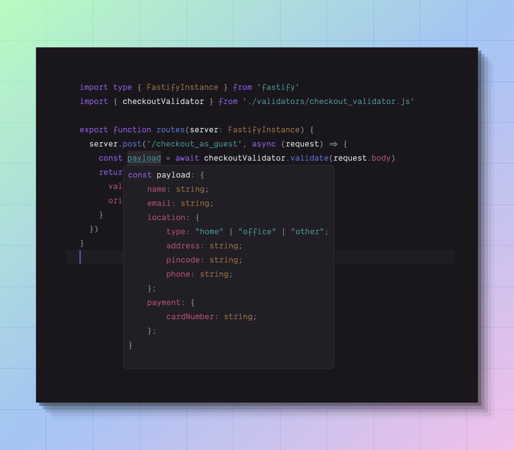

# VineJS ❤️ Fastify
> An example application using VineJS to validate the Fastify request body along with functional tests.

## What's in the box?

- ESM application 😍
- TypeScript setup with TS Node and SWC.
- A basic fastify application
- VineJS for validating request body
- Japa for writing HTTP requests ( real requests are sent to the server ).

## What is VineJS?
VineJS is a highly performant library to validate the HTTP request body in your backend applications. It is type-safe and has a vast collection of validation rules and schema types.

You can learn more about it on the [official documentation website](https://vinejs.dev/docs/introduction).

## Setup
- Clone this repo directly using Git or using `npx degit vinejs/vinejs-example-fastify`.
- Run `npm install` to install dependencies.
- Start the development server using the `npm run dev` script.
- Run tests using the `npm test` script.

## Code organization
- The functional code is kept inside the `./src/` directory. It includes routes and validators.
- The fastify application is created inside the `app.ts` file. The same instance is used for testing and running the server.
- The `server.ts` file starts the server.
- The `bin/test.ts` file is used to run the tests. We use the Japa setup hooks to start the server before running any tests.

